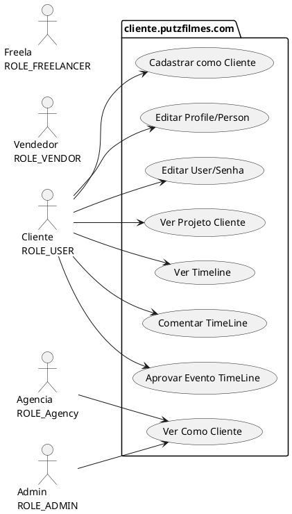

```plantuml

@startuml
left to right direction
actor "Cliente\nROLE_USER" as cli

left to right direction
actor "Vendedor\nROLE_VENDOR" as vend
actor "Agencia\nROLE_Agency" as agen

actor "Freela\nROLE_FREELANCER" as freela

actor "Admin\nROLE_ADMIN" as admin

package cliente.putzfilmes.com {

  usecase "Cadastrar como Cliente" as eCadCliente
  usecase "Editar Profile/Person" as eProfileCompany
  usecase "Editar User/Senha" as eUser
  usecase "Ver Projeto Cliente" as vProjetoCli
  usecase "Ver Timeline" as vTimeline
  usecase "Comentar TimeLine" as commentEvent
  usecase "Aprovar Evento TimeLine" as aproveEvent
  usecase "Ver Como Cliente" as viewAsCli

}

cli --> vProjetoCli
cli --> vTimeline
cli --> commentEvent
cli --> aproveEvent
cli --> eCadCliente
cli --> eUser
cli --> eProfileCompany
admin --> viewAsCli
agen --> viewAsCli

@enduml

```