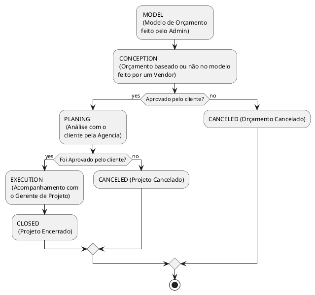

```plantuml
@startuml
: MODEL \n (Modelo de Orçamento \nfeito pelo Admin);
: CONCEPTION \n (Orçamento baseado ou não no modelo \nfeito por um Vendor);

if (Aprovado pelo cliente?) then (yes)
  :PLANING \n (Análise com o\ncliente pela Agencia);
    if (Foi Aprovado pelo cliente?) then (yes)
      :EXECUTION \n (Acompanhamento com\no Gerente de Projeto);
      :CLOSED \n (Projeto Encerrado);
    else (no)
      :CANCELED (Projeto Cancelado);
    endif
else (no)
  :CANCELED (Orçamento Cancelado);
endif
stop
@enduml
```